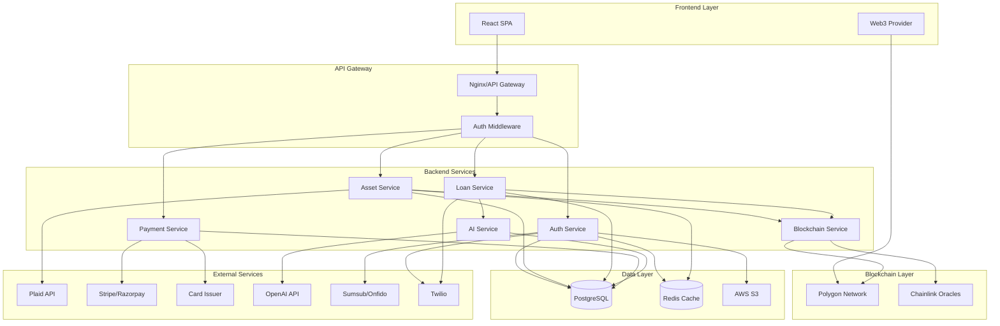

# Design Document: AssetBridge Production Transformation

## Overview

AssetBridge transforms from a frontend prototype into a production-ready platform with three core layers:

1. **Frontend Layer**: React/TypeScript SPA with real-time updates and Web3 integration
2. **Backend Layer**: Node.js/Express RESTful API with PostgreSQL database and Redis caching
3. **Blockchain Layer**: Solidity smart contracts on Polygon for asset tokenization and loan management

The architecture follows a microservices-inspired approach with clear separation of concerns:
- Authentication & Authorization service
- Asset Management service
- Loan & Credit service
- Payment Processing service
- Blockchain Integration service
- AI/ML Credit Scoring service

All services communicate through RESTful APIs with JWT-based authentication. External integrations include:
- Plaid/Finicity for bank linking
- Stripe/Razorpay for payments
- Marqeta/Stripe Issuing for card issuance
- OpenAI API for credit scoring
- Chainlink oracles for price feeds
- Sumsub/Onfido for KYC verification

## Architecture

### System Architecture Diagram



### Technology Stack

**Frontend:**
- React 19 + TypeScript
- Vite (build tool)
- TailwindCSS (styling)
- React Query (API state management)
- Zustand (global state)
- React Hook Form + Zod (forms & validation)
- Ethers.js (Web3 integration)
- Framer Motion (animations)

**Backend:**
- Node.js 20+ with Express.js
- TypeScript
- PostgreSQL 15+ (primary database)
- Redis 7+ (caching & sessions)
- JWT (authentication)
- Bcrypt (password hashing)
- Joi/Zod (validation)
- Prisma/TypeORM (ORM)
- Bull (job queues)
- Winston (logging)

**Blockchain:**
- Solidity 0.8+
- Hardhat (development framework)
- OpenZeppelin contracts
- Ethers.js (blockchain interaction)
- Polygon Mumbai (testnet)
- Polygon mainnet (production)

**DevOps:**
- Docker & Docker Compose
- AWS/GCP (hosting)
- GitHub Actions (CI/CD)
- Nginx (reverse proxy)
- Let's Encrypt (SSL)
- PM2 (process management)

### Security Architecture

**Authentication Flow:**
1. User submits credentials → Backend validates → Issues JWT (access + refresh tokens)
2. Access token: 15-minute expiry, stored in memory
3. Refresh token: 7-day expiry, stored in httpOnly cookie
4. All API requests include access token in Authorization header
5. Token refresh endpoint exchanges refresh token for new access token

**Authorization:**
- Role-based access control (RBAC)
- Permissions: `user:read`, `user:write`, `asset:lock`, `loan:create`, `admin:all`
- Middleware checks JWT claims and user role before allowing access

**Data Security:**
- All passwords hashed with bcrypt (cost factor: 12)
- Sensitive data encrypted at rest (AES-256)
- TLS 1.3 for all data in transit
- KYC documents stored in encrypted S3 buckets
- Database credentials stored in environment variables
- API keys rotated every 90 days

**API Security:**
- Rate limiting: 100 requests/minute per user
- CORS configured for allowed origins only
- CSRF protection on state-changing operations
- Input validation and sanitization
- SQL injection prevention via parameterized queries
- XSS prevention via output encoding

## Components and Interfaces

### 1. Authentication Service

**Responsibilities:**
- User registration and login
- JWT token generation and validation
- Password reset flow
- Session management
- KYC document processing

**Key Interfaces:**

```typescript
interface AuthService {
  register(data: RegisterDTO): Promise<User>;
  login(credentials: LoginDTO): Promise<AuthTokens>;
  verifyEmail(token: string): Promise<boolean>;
  resetPassword(email: string): Promise<void>;
  changePassword(userId: string, oldPassword: string, newPassword: string): Promise<void>;
  refreshToken(refreshToken: string): Promise<AuthTokens>;
  logout(userId: string): Promise<void>;
}

interface KYCService {
  submitKYC(userId: string, data: KYCData): Promise<KYCSubmission>;
  uploadDocument(userId: string, docType: DocumentType, file: File): Promise<Document>;
  verifyDocuments(userId: string): Promise<KYCVerificationResult>;
  getKYCStatus(userId: string): Promise<KYCStatus>;
}

interface RegisterDTO {
  email: string;
  phone: string;
  password: string;
  firstName: string;
  lastName: string;
}

interface LoginDTO {
  email: string;
  password: string;
}

interface AuthTokens {
  accessToken: string;
  refreshToken: string;
  expiresIn: number;
}
```

### 2. Asset Management Service

**Responsibilities:**
- Link external accounts (bank, stocks, mutual funds)
- Fetch and update asset valuations
- Lock/unlock assets
- Calculate LTV ratios and credit limits
- Trigger tokenization

**Key Interfaces:**

```typescript
interface AssetService {
  linkBankAccount(userId: string, plaidToken: string): Promise<BankAccount>;
  linkStockPortfolio(userId: string, credentials: StockCredentials): Promise<StockPortfolio>;
  addAsset(userId: string, asset: AssetDTO): Promise<Asset>;
  getAssets(userId: string): Promise<Asset[]>;
  lockAsset(userId: string, assetId: string): Promise<LockedAsset>;
  unlockAsset(userId: string, assetId: string): Promise<void>;
  calculateCreditLimit(assetId: string): Promise<CreditLimit>;
  refreshAssetValues(userId: string): Promise<void>;
}

interface Asset {
  id: string;
  userId: string;
  type: AssetType; // 'FD' | 'STOCK' | 'MUTUAL_FUND' | 'GOLD' | 'PROPERTY'
  name: string;
  currentValue: number;
  currency: string;
  status: AssetStatus; // 'ACTIVE' | 'LOCKED' | 'LIQUIDATED'
  metadata: Record<string, any>;
  createdAt: Date;
  updatedAt: Date;
}

interface LockedAsset extends Asset {
  tokenId: string;
  contractAddress: string;
  ltvRatio: number;
  creditLimit: number;
  lockedAt: Date;
}

interface CreditLimit {
  assetValue: number;
  ltvRatio: number;
  availableCredit: number;
  usedCredit: number;
}
```

### 3. Loan Service

**Responsibilities:**
- Create and manage loan requests
- Match borrowers with lenders
- Handle loan agreements and disbursements
- Manage repayment schedules
- Process defaults and liquidations

**Key Interfaces:**

```typescript
interface LoanService {
  createLoanRequest(borrowerId: string, request: LoanRequestDTO): Promise<LoanRequest>;
  getLoanRequests(filters: LoanFilters): Promise<LoanRequest[]>;
  makeLoanOffer(lenderId: string, requestId: string, offer: LoanOfferDTO): Promise<LoanOffer>;
  acceptLoanOffer(borrowerId: string, offerId: string): Promise<Loan>;
  disburseLoan(loanId: string): Promise<Disbursement>;
  processRepayment(loanId: string, amount: number): Promise<Repayment>;
  handleDefault(loanId: string): Promise<Liquidation>;
  getLoansByUser(userId: string, role: 'BORROWER' | 'LENDER'): Promise<Loan[]>;
}

interface LoanRequest {
  id: string;
  borrowerId: string;
  amount: number;
  currency: string;
  tenure: number; // months
  purpose: string;
  collateralAssetIds: string[];
  requestedInterestRate: number;
  status: LoanRequestStatus; // 'OPEN' | 'MATCHED' | 'CLOSED'
  createdAt: Date;
}

interface Loan {
  id: string;
  borrowerId: string;
  lenderId: string;
  amount: number;
  interestRate: number;
  tenure: number;
  emiAmount: number;
  collateralTokenIds: string[];
  status: LoanStatus; // 'ACTIVE' | 'REPAID' | 'DEFAULTED'
  disbursedAt: Date;
  nextPaymentDue: Date;
}
```

### 4. Payment Service

**Responsibilities:**
- Process payments via Stripe/Razorpay
- Issue virtual credit cards
- Handle card transactions
- Manage refunds and disputes

**Key Interfaces:**

```typescript
interface PaymentService {
  createPaymentIntent(userId: string, amount: number, purpose: string): Promise<PaymentIntent>;
  processPayment(paymentId: string): Promise<Payment>;
  handleWebhook(event: WebhookEvent): Promise<void>;
  issueVirtualCard(userId: string, creditLimit: number): Promise<VirtualCard>;
  getCardTransactions(cardId: string): Promise<CardTransaction[]>;
  freezeCard(cardId: string): Promise<void>;
  unfreezeCard(cardId: string): Promise<void>;
}

interface VirtualCard {
  id: string;
  userId: string;
  cardNumber: string; // encrypted
  cvv: string; // encrypted
  expiryMonth: number;
  expiryYear: number;
  creditLimit: number;
  availableBalance: number;
  status: CardStatus; // 'ACTIVE' | 'FROZEN' | 'CANCELLED'
  issuedAt: Date;
}

interface CardTransaction {
  id: string;
  cardId: string;
  amount: number;
  currency: string;
  merchant: string;
  status: TransactionStatus; // 'PENDING' | 'COMPLETED' | 'DECLINED'
  timestamp: Date;
}
```

### 5. Blockchain Service

**Responsibilities:**
- Interact with smart contracts
- Mint and burn RWA tokens
- Manage loan escrows
- Fetch oracle data
- Track transaction status

**Key Interfaces:**

```typescript
interface BlockchainService {
  mintAssetToken(assetId: string, metadata: TokenMetadata): Promise<TokenMintResult>;
  burnAssetToken(tokenId: string): Promise<TransactionReceipt>;
  createLoanEscrow(loanId: string, collateralTokenIds: string[]): Promise<EscrowContract>;
  releaseLoanEscrow(loanId: string): Promise<TransactionReceipt>;
  liquidateCollateral(loanId: string): Promise<LiquidationResult>;
  getFXRate(fromCurrency: string, toCurrency: string): Promise<number>;
  getAssetPrice(assetType: string): Promise<number>;
  getTransactionStatus(txHash: string): Promise<TransactionStatus>;
}

interface TokenMintResult {
  tokenId: string;
  contractAddress: string;
  transactionHash: string;
  blockNumber: number;
}

interface TokenMetadata {
  assetType: string;
  assetValue: number;
  currency: string;
  ownerAddress: string;
  custodianInfo: string;
}
```

### 6. AI Credit Scoring Service

**Responsibilities:**
- Process financial documents (OCR)
- Analyze income and spending patterns
- Calculate trust scores
- Provide explainable insights
- Detect fraud

**Key Interfaces:**

```typescript
interface AIService {
  processDocument(userId: string, docType: DocumentType, file: File): Promise<ProcessedDocument>;
  calculateTrustScore(userId: string): Promise<TrustScore>;
  analyzeBankStatement(data: BankStatementData): Promise<IncomeAnalysis>;
  detectFraud(userId: string): Promise<FraudRiskScore>;
  getScoreExplanation(userId: string): Promise<ScoreExplanation>;
}

interface TrustScore {
  userId: string;
  score: number; // 0-1000
  factors: ScoreFactor[];
  calculatedAt: Date;
  nextUpdateAt: Date;
}

interface ScoreFactor {
  name: string;
  weight: number;
  value: number;
  impact: 'POSITIVE' | 'NEGATIVE' | 'NEUTRAL';
}

interface ScoreExplanation {
  positiveFactors: string[];
  negativeFactors: string[];
  improvementSuggestions: string[];
}
```

## Data Models

### Database Schema

**Users Table:**
```sql
CREATE TABLE users (
  id UUID PRIMARY KEY DEFAULT gen_random_uuid(),
  email VARCHAR(255) UNIQUE NOT NULL,
  phone VARCHAR(20) UNIQUE NOT NULL,
  password_hash VARCHAR(255) NOT NULL,
  first_name VARCHAR(100) NOT NULL,
  last_name VARCHAR(100) NOT NULL,
  date_of_birth DATE,
  nationality VARCHAR(50),
  role VARCHAR(20) DEFAULT 'USER', -- USER, LENDER, BORROWER, ADMIN
  kyc_status VARCHAR(20) DEFAULT 'PENDING', -- PENDING, SUBMITTED, APPROVED, REJECTED
  email_verified BOOLEAN DEFAULT FALSE,
  phone_verified BOOLEAN DEFAULT FALSE,
  wallet_address VARCHAR(42),
  created_at TIMESTAMP DEFAULT NOW(),
  updated_at TIMESTAMP DEFAULT NOW(),
  deleted_at TIMESTAMP
);

CREATE INDEX idx_users_email ON users(email);
CREATE INDEX idx_users_kyc_status ON users(kyc_status);
```

**KYC Documents Table:**
```sql
CREATE TABLE kyc_documents (
  id UUID PRIMARY KEY DEFAULT gen_random_uuid(),
  user_id UUID REFERENCES users(id) ON DELETE CASCADE,
  document_type VARCHAR(50) NOT NULL, -- PASSPORT, AADHAAR, PAN, ADDRESS_PROOF, SELFIE
  file_url VARCHAR(500) NOT NULL,
  file_hash VARCHAR(64),
  ocr_data JSONB,
  verification_status VARCHAR(20) DEFAULT 'PENDING',
  verified_at TIMESTAMP,
  created_at TIMESTAMP DEFAULT NOW()
);

CREATE INDEX idx_kyc_user_id ON kyc_documents(user_id);
```

**Assets Table:**
```sql
CREATE TABLE assets (
  id UUID PRIMARY KEY DEFAULT gen_random_uuid(),
  user_id UUID REFERENCES users(id) ON DELETE CASCADE,
  asset_type VARCHAR(20) NOT NULL, -- FD, STOCK, MUTUAL_FUND, GOLD, PROPERTY
  name VARCHAR(255) NOT NULL,
  current_value DECIMAL(15, 2) NOT NULL,
  currency VARCHAR(3) DEFAULT 'INR',
  status VARCHAR(20) DEFAULT 'ACTIVE', -- ACTIVE, LOCKED, LIQUIDATED
  metadata JSONB, -- asset-specific data
  external_id VARCHAR(255), -- ID from external system (Plaid, etc.)
  last_valuation_at TIMESTAMP,
  created_at TIMESTAMP DEFAULT NOW(),
  updated_at TIMESTAMP DEFAULT NOW(),
  deleted_at TIMESTAMP
);

CREATE INDEX idx_assets_user_id ON assets(user_id);
CREATE INDEX idx_assets_status ON assets(status);
```

**Locked Assets Table:**
```sql
CREATE TABLE locked_assets (
  id UUID PRIMARY KEY DEFAULT gen_random_uuid(),
  asset_id UUID REFERENCES assets(id) ON DELETE CASCADE,
  user_id UUID REFERENCES users(id) ON DELETE CASCADE,
  token_id VARCHAR(100) UNIQUE NOT NULL,
  contract_address VARCHAR(42) NOT NULL,
  transaction_hash VARCHAR(66),
  ltv_ratio DECIMAL(5, 2) NOT NULL, -- e.g., 70.00 for 70%
  credit_limit DECIMAL(15, 2) NOT NULL,
  used_credit DECIMAL(15, 2) DEFAULT 0,
  locked_at TIMESTAMP DEFAULT NOW(),
  unlocked_at TIMESTAMP
);

CREATE INDEX idx_locked_assets_user_id ON locked_assets(user_id);
CREATE INDEX idx_locked_assets_token_id ON locked_assets(token_id);
```

**Loan Requests Table:**
```sql
CREATE TABLE loan_requests (
  id UUID PRIMARY KEY DEFAULT gen_random_uuid(),
  borrower_id UUID REFERENCES users(id) ON DELETE CASCADE,
  amount DECIMAL(15, 2) NOT NULL,
  currency VARCHAR(3) DEFAULT 'INR',
  tenure INTEGER NOT NULL, -- months
  purpose TEXT,
  requested_interest_rate DECIMAL(5, 2),
  status VARCHAR(20) DEFAULT 'OPEN', -- OPEN, MATCHED, CLOSED
  created_at TIMESTAMP DEFAULT NOW(),
  updated_at TIMESTAMP DEFAULT NOW()
);

CREATE INDEX idx_loan_requests_borrower_id ON loan_requests(borrower_id);
CREATE INDEX idx_loan_requests_status ON loan_requests(status);
```

**Loan Request Collateral Table:**
```sql
CREATE TABLE loan_request_collateral (
  id UUID PRIMARY KEY DEFAULT gen_random_uuid(),
  loan_request_id UUID REFERENCES loan_requests(id) ON DELETE CASCADE,
  locked_asset_id UUID REFERENCES locked_assets(id) ON DELETE CASCADE,
  created_at TIMESTAMP DEFAULT NOW()
);
```

**Loan Offers Table:**
```sql
CREATE TABLE loan_offers (
  id UUID PRIMARY KEY DEFAULT gen_random_uuid(),
  loan_request_id UUID REFERENCES loan_requests(id) ON DELETE CASCADE,
  lender_id UUID REFERENCES users(id) ON DELETE CASCADE,
  interest_rate DECIMAL(5, 2) NOT NULL,
  conditions TEXT,
  status VARCHAR(20) DEFAULT 'PENDING', -- PENDING, ACCEPTED, REJECTED, EXPIRED
  created_at TIMESTAMP DEFAULT NOW(),
  expires_at TIMESTAMP
);

CREATE INDEX idx_loan_offers_request_id ON loan_offers(loan_request_id);
CREATE INDEX idx_loan_offers_lender_id ON loan_offers(lender_id);
```

**Loans Table:**
```sql
CREATE TABLE loans (
  id UUID PRIMARY KEY DEFAULT gen_random_uuid(),
  loan_request_id UUID REFERENCES loan_requests(id),
  loan_offer_id UUID REFERENCES loan_offers(id),
  borrower_id UUID REFERENCES users(id) ON DELETE CASCADE,
  lender_id UUID REFERENCES users(id) ON DELETE CASCADE,
  amount DECIMAL(15, 2) NOT NULL,
  currency VARCHAR(3) DEFAULT 'INR',
  interest_rate DECIMAL(5, 2) NOT NULL,
  tenure INTEGER NOT NULL,
  emi_amount DECIMAL(15, 2) NOT NULL,
  total_repaid DECIMAL(15, 2) DEFAULT 0,
  status VARCHAR(20) DEFAULT 'ACTIVE', -- ACTIVE, REPAID, DEFAULTED
  escrow_contract_address VARCHAR(42),
  disbursed_at TIMESTAMP,
  next_payment_due TIMESTAMP,
  completed_at TIMESTAMP,
  created_at TIMESTAMP DEFAULT NOW(),
  updated_at TIMESTAMP DEFAULT NOW()
);

CREATE INDEX idx_loans_borrower_id ON loans(borrower_id);
CREATE INDEX idx_loans_lender_id ON loans(lender_id);
CREATE INDEX idx_loans_status ON loans(status);
```

**Loan Collateral Table:**
```sql
CREATE TABLE loan_collateral (
  id UUID PRIMARY KEY DEFAULT gen_random_uuid(),
  loan_id UUID REFERENCES loans(id) ON DELETE CASCADE,
  locked_asset_id UUID REFERENCES locked_assets(id) ON DELETE CASCADE,
  token_id VARCHAR(100) NOT NULL,
  created_at TIMESTAMP DEFAULT NOW()
);
```

**Repayments Table:**
```sql
CREATE TABLE repayments (
  id UUID PRIMARY KEY DEFAULT gen_random_uuid(),
  loan_id UUID REFERENCES loans(id) ON DELETE CASCADE,
  amount DECIMAL(15, 2) NOT NULL,
  principal_amount DECIMAL(15, 2) NOT NULL,
  interest_amount DECIMAL(15, 2) NOT NULL,
  payment_method VARCHAR(50),
  transaction_id VARCHAR(255),
  status VARCHAR(20) DEFAULT 'PENDING', -- PENDING, COMPLETED, FAILED
  due_date TIMESTAMP,
  paid_at TIMESTAMP,
  created_at TIMESTAMP DEFAULT NOW()
);

CREATE INDEX idx_repayments_loan_id ON repayments(loan_id);
CREATE INDEX idx_repayments_due_date ON repayments(due_date);
```

**Virtual Cards Table:**
```sql
CREATE TABLE virtual_cards (
  id UUID PRIMARY KEY DEFAULT gen_random_uuid(),
  user_id UUID REFERENCES users(id) ON DELETE CASCADE,
  card_number_encrypted TEXT NOT NULL,
  cvv_encrypted TEXT NOT NULL,
  expiry_month INTEGER NOT NULL,
  expiry_year INTEGER NOT NULL,
  credit_limit DECIMAL(15, 2) NOT NULL,
  available_balance DECIMAL(15, 2) NOT NULL,
  status VARCHAR(20) DEFAULT 'ACTIVE', -- ACTIVE, FROZEN, CANCELLED
  external_card_id VARCHAR(255), -- ID from card issuer
  issued_at TIMESTAMP DEFAULT NOW(),
  created_at TIMESTAMP DEFAULT NOW(),
  updated_at TIMESTAMP DEFAULT NOW()
);

CREATE INDEX idx_virtual_cards_user_id ON virtual_cards(user_id);
```

**Card Transactions Table:**
```sql
CREATE TABLE card_transactions (
  id UUID PRIMARY KEY DEFAULT gen_random_uuid(),
  card_id UUID REFERENCES virtual_cards(id) ON DELETE CASCADE,
  amount DECIMAL(15, 2) NOT NULL,
  currency VARCHAR(3) DEFAULT 'INR',
  merchant_name VARCHAR(255),
  merchant_category VARCHAR(100),
  status VARCHAR(20) DEFAULT 'PENDING', -- PENDING, COMPLETED, DECLINED
  external_transaction_id VARCHAR(255),
  transaction_timestamp TIMESTAMP DEFAULT NOW(),
  created_at TIMESTAMP DEFAULT NOW()
);

CREATE INDEX idx_card_transactions_card_id ON card_transactions(card_id);
CREATE INDEX idx_card_transactions_timestamp ON card_transactions(transaction_timestamp);
```

**Trust Scores Table:**
```sql
CREATE TABLE trust_scores (
  id UUID PRIMARY KEY DEFAULT gen_random_uuid(),
  user_id UUID REFERENCES users(id) ON DELETE CASCADE,
  score INTEGER NOT NULL CHECK (score >= 0 AND score <= 1000),
  factors JSONB NOT NULL, -- array of score factors
  income_stability_score DECIMAL(5, 2),
  credit_history_score DECIMAL(5, 2),
  asset_coverage_score DECIMAL(5, 2),
  debt_to_income_score DECIMAL(5, 2),
  cross_border_score DECIMAL(5, 2),
  fraud_risk_score DECIMAL(5, 2),
  calculated_at TIMESTAMP DEFAULT NOW(),
  next_update_at TIMESTAMP,
  created_at TIMESTAMP DEFAULT NOW()
);

CREATE INDEX idx_trust_scores_user_id ON trust_scores(user_id);
CREATE INDEX idx_trust_scores_calculated_at ON trust_scores(calculated_at);
```

**Payments Table:**
```sql
CREATE TABLE payments (
  id UUID PRIMARY KEY DEFAULT gen_random_uuid(),
  user_id UUID REFERENCES users(id) ON DELETE CASCADE,
  amount DECIMAL(15, 2) NOT NULL,
  currency VARCHAR(3) DEFAULT 'INR',
  purpose VARCHAR(100) NOT NULL, -- TOKENIZATION_FEE, LOAN_REPAYMENT, CARD_FEE, etc.
  payment_method VARCHAR(50),
  external_payment_id VARCHAR(255),
  status VARCHAR(20) DEFAULT 'PENDING', -- PENDING, COMPLETED, FAILED, REFUNDED
  metadata JSONB,
  created_at TIMESTAMP DEFAULT NOW(),
  completed_at TIMESTAMP
);

CREATE INDEX idx_payments_user_id ON payments(user_id);
CREATE INDEX idx_payments_status ON payments(status);
```

**Notifications Table:**
```sql
CREATE TABLE notifications (
  id UUID PRIMARY KEY DEFAULT gen_random_uuid(),
  user_id UUID REFERENCES users(id) ON DELETE CASCADE,
  type VARCHAR(50) NOT NULL, -- EMAIL, SMS, PUSH, IN_APP
  channel VARCHAR(50) NOT NULL,
  subject VARCHAR(255),
  message TEXT NOT NULL,
  status VARCHAR(20) DEFAULT 'PENDING', -- PENDING, SENT, FAILED
  sent_at TIMESTAMP,
  created_at TIMESTAMP DEFAULT NOW()
);

CREATE INDEX idx_notifications_user_id ON notifications(user_id);
CREATE INDEX idx_notifications_status ON notifications(status);
```

**Audit Logs Table:**
```sql
CREATE TABLE audit_logs (
  id UUID PRIMARY KEY DEFAULT gen_random_uuid(),
  user_id UUID REFERENCES users(id),
  action VARCHAR(100) NOT NULL,
  resource_type VARCHAR(50),
  resource_id UUID,
  ip_address INET,
  user_agent TEXT,
  metadata JSONB,
  created_at TIMESTAMP DEFAULT NOW()
);

CREATE INDEX idx_audit_logs_user_id ON audit_logs(user_id);
CREATE INDEX idx_audit_logs_created_at ON audit_logs(created_at);
```

### Redis Cache Schema

**Session Storage:**
```
Key: session:{userId}
Value: { accessToken, refreshToken, expiresAt, userRole }
TTL: 7 days
```

**Asset Price Cache:**
```
Key: asset_price:{assetType}:{currency}
Value: { price, timestamp }
TTL: 5 minutes
```

**FX Rate Cache:**
```
Key: fx_rate:{fromCurrency}:{toCurrency}
Value: { rate, timestamp }
TTL: 5 minutes
```

**User Credit Limit Cache:**
```
Key: credit_limit:{userId}
Value: { totalLimit, usedCredit, availableCredit }
TTL: 1 hour
```

**Rate Limiting:**
```
Key: rate_limit:{userId}:{endpoint}
Value: request_count
TTL: 1 minute
```

## API Specifications

### Base URL
```
Development: http://localhost:3000/api/v1
Production: https://api.assetbridge.com/api/v1
```

### Authentication Endpoints

**POST /auth/register**
```json
Request:
{
  "email": "user@example.com",
  "phone": "+919876543210",
  "password": "SecurePass123!",
  "firstName": "John",
  "lastName": "Doe"
}

Response (201):
{
  "status": "success",
  "data": {
    "userId": "uuid",
    "email": "user@example.com",
    "verificationRequired": true
  }
}
```

**POST /auth/login**
```json
Request:
{
  "email": "user@example.com",
  "password": "SecurePass123!"
}

Response (200):
{
  "status": "success",
  "data": {
    "accessToken": "jwt_token",
    "refreshToken": "refresh_token",
    "expiresIn": 900,
    "user": {
      "id": "uuid",
      "email": "user@example.com",
      "firstName": "John",
      "lastName": "Doe",
      "role": "USER",
      "kycStatus": "APPROVED"
    }
  }
}
```

**POST /auth/verify-email**
```json
Request:
{
  "token": "verification_token"
}

Response (200):
{
  "status": "success",
  "data": {
    "verified": true
  }
}
```

**POST /auth/refresh-token**
```json
Request:
{
  "refreshToken": "refresh_token"
}

Response (200):
{
  "status": "success",
  "data": {
    "accessToken": "new_jwt_token",
    "expiresIn": 900
  }
}
```

**POST /auth/logout**
```json
Headers: Authorization: Bearer {accessToken}

Response (200):
{
  "status": "success",
  "data": {
    "message": "Logged out successfully"
  }
}
```

### KYC Endpoints

**POST /kyc/submit**
```json
Headers: Authorization: Bearer {accessToken}

Request:
{
  "personalDetails": {
    "dateOfBirth": "1990-01-01",
    "address": "123 Main St, City, Country",
    "nationality": "Indian",
    "panNumber": "ABCDE1234F"
  }
}

Response (201):
{
  "status": "success",
  "data": {
    "kycSubmissionId": "uuid",
    "status": "SUBMITTED"
  }
}
```

**POST /kyc/upload-document**
```json
Headers: 
  Authorization: Bearer {accessToken}
  Content-Type: multipart/form-data

Request:
{
  "documentType": "PASSPORT",
  "file": <binary>
}

Response (201):
{
  "status": "success",
  "data": {
    "documentId": "uuid",
    "fileUrl": "https://s3.amazonaws.com/...",
    "ocrData": {
      "documentNumber": "A12345678",
      "expiryDate": "2030-12-31"
    }
  }
}
```

**GET /kyc/status**
```json
Headers: Authorization: Bearer {accessToken}

Response (200):
{
  "status": "success",
  "data": {
    "kycStatus": "APPROVED",
    "documents": [
      {
        "type": "PASSPORT",
        "status": "VERIFIED",
        "uploadedAt": "2024-01-15T10:30:00Z"
      }
    ]
  }
}
```

### Asset Endpoints

**POST /assets/link-bank**
```json
Headers: Authorization: Bearer {accessToken}

Request:
{
  "plaidPublicToken": "public-token-from-plaid"
}

Response (201):
{
  "status": "success",
  "data": {
    "accountId": "uuid",
    "bankName": "HDFC Bank",
    "accountType": "SAVINGS",
    "balance": 150000.00,
    "currency": "INR"
  }
}
```

**GET /assets**
```json
Headers: Authorization: Bearer {accessToken}

Response (200):
{
  "status": "success",
  "data": {
    "assets": [
      {
        "id": "uuid",
        "type": "FD",
        "name": "HDFC Fixed Deposit",
        "currentValue": 500000.00,
        "currency": "INR",
        "status": "ACTIVE",
        "lastValuationAt": "2024-01-20T08:00:00Z"
      },
      {
        "id": "uuid",
        "type": "STOCK",
        "name": "Stock Portfolio",
        "currentValue": 1200000.00,
        "currency": "INR",
        "status": "LOCKED",
        "lastValuationAt": "2024-01-20T15:30:00Z"
      }
    ],
    "totalValue": 1700000.00
  }
}
```

**POST /assets/lock**
```json
Headers: Authorization: Bearer {accessToken}

Request:
{
  "assetId": "uuid"
}

Response (201):
{
  "status": "success",
  "data": {
    "lockedAssetId": "uuid",
    "tokenId": "12345",
    "contractAddress": "0x...",
    "transactionHash": "0x...",
    "ltvRatio": 70.00,
    "creditLimit": 840000.00
  }
}
```

**POST /assets/unlock**
```json
Headers: Authorization: Bearer {accessToken}

Request:
{
  "assetId": "uuid"
}

Response (200):
{
  "status": "success",
  "data": {
    "assetId": "uuid",
    "status": "ACTIVE",
    "transactionHash": "0x..."
  }
}
```

**GET /assets/credit-limit**
```json
Headers: Authorization: Bearer {accessToken}

Response (200):
{
  "status": "success",
  "data": {
    "totalCreditLimit": 1500000.00,
    "usedCredit": 300000.00,
    "availableCredit": 1200000.00,
    "lockedAssets": [
      {
        "assetId": "uuid",
        "assetValue": 1000000.00,
        "ltvRatio": 70.00,
        "creditLimit": 700000.00
      }
    ]
  }
}
```

### Loan Endpoints

**POST /loans/requests**
```json
Headers: Authorization: Bearer {accessToken}

Request:
{
  "amount": 500000.00,
  "currency": "INR",
  "tenure": 12,
  "purpose": "Business expansion",
  "collateralAssetIds": ["uuid1", "uuid2"],
  "requestedInterestRate": 8.5
}

Response (201):
{
  "status": "success",
  "data": {
    "loanRequestId": "uuid",
    "status": "OPEN",
    "createdAt": "2024-01-20T10:00:00Z"
  }
}
```

**GET /loans/requests**
```json
Headers: Authorization: Bearer {accessToken}

Query Params: ?status=OPEN&minAmount=100000&maxAmount=1000000

Response (200):
{
  "status": "success",
  "data": {
    "loanRequests": [
      {
        "id": "uuid",
        "borrowerId": "uuid",
        "borrowerTrustScore": 750,
        "amount": 500000.00,
        "tenure": 12,
        "collateralValue": 800000.00,
        "requestedInterestRate": 8.5,
        "status": "OPEN"
      }
    ],
    "pagination": {
      "total": 25,
      "page": 1,
      "limit": 10
    }
  }
}
```

**POST /loans/offers**
```json
Headers: Authorization: Bearer {accessToken}

Request:
{
  "loanRequestId": "uuid",
  "interestRate": 9.0,
  "conditions": "Repayment via auto-debit only"
}

Response (201):
{
  "status": "success",
  "data": {
    "loanOfferId": "uuid",
    "status": "PENDING",
    "expiresAt": "2024-01-27T10:00:00Z"
  }
}
```

**POST /loans/offers/:offerId/accept**
```json
Headers: Authorization: Bearer {accessToken}

Response (200):
{
  "status": "success",
  "data": {
    "loanId": "uuid",
    "amount": 500000.00,
    "interestRate": 9.0,
    "emiAmount": 43958.33,
    "escrowContractAddress": "0x...",
    "disbursementStatus": "PENDING"
  }
}
```

**GET /loans/my-loans**
```json
Headers: Authorization: Bearer {accessToken}

Query Params: ?role=BORROWER

Response (200):
{
  "status": "success",
  "data": {
    "loans": [
      {
        "id": "uuid",
        "amount": 500000.00,
        "interestRate": 9.0,
        "tenure": 12,
        "emiAmount": 43958.33,
        "totalRepaid": 131875.00,
        "remainingAmount": 368125.00,
        "status": "ACTIVE",
        "nextPaymentDue": "2024-02-01T00:00:00Z"
      }
    ]
  }
}
```

**POST /loans/:loanId/repay**
```json
Headers: Authorization: Bearer {accessToken}

Request:
{
  "amount": 43958.33,
  "paymentMethod": "BANK_TRANSFER"
}

Response (200):
{
  "status": "success",
  "data": {
    "repaymentId": "uuid",
    "principalAmount": 37291.67,
    "interestAmount": 6666.66,
    "remainingBalance": 324166.67,
    "nextPaymentDue": "2024-03-01T00:00:00Z"
  }
}
```

### Payment Endpoints

**POST /payments/create-intent**
```json
Headers: Authorization: Bearer {accessToken}

Request:
{
  "amount": 2500.00,
  "currency": "INR",
  "purpose": "TOKENIZATION_FEE"
}

Response (201):
{
  "status": "success",
  "data": {
    "paymentIntentId": "uuid",
    "clientSecret": "pi_xxx_secret_xxx",
    "amount": 2500.00,
    "currency": "INR"
  }
}
```

**POST /payments/webhook**
```json
Headers: Stripe-Signature: signature

Request:
{
  "type": "payment_intent.succeeded",
  "data": {
    "object": {
      "id": "pi_xxx",
      "amount": 2500,
      "status": "succeeded"
    }
  }
}

Response (200):
{
  "received": true
}
```

### Virtual Card Endpoints

**POST /cards/issue**
```json
Headers: Authorization: Bearer {accessToken}

Request:
{
  "creditLimit": 500000.00
}

Response (201):
{
  "status": "success",
  "data": {
    "cardId": "uuid",
    "cardNumber": "****-****-****-1234",
    "expiryMonth": 12,
    "expiryYear": 2028,
    "creditLimit": 500000.00,
    "availableBalance": 500000.00,
    "status": "ACTIVE"
  }
}
```

**GET /cards/:cardId/details**
```json
Headers: Authorization: Bearer {accessToken}

Response (200):
{
  "status": "success",
  "data": {
    "cardNumber": "4532-1234-5678-9012",
    "cvv": "123",
    "expiryMonth": 12,
    "expiryYear": 2028
  }
}
```

**GET /cards/:cardId/transactions**
```json
Headers: Authorization: Bearer {accessToken}

Response (200):
{
  "status": "success",
  "data": {
    "transactions": [
      {
        "id": "uuid",
        "amount": 5000.00,
        "currency": "INR",
        "merchant": "Amazon India",
        "status": "COMPLETED",
        "timestamp": "2024-01-20T14:30:00Z"
      }
    ],
    "pagination": {
      "total": 50,
      "page": 1,
      "limit": 20
    }
  }
}
```

**POST /cards/:cardId/freeze**
```json
Headers: Authorization: Bearer {accessToken}

Response (200):
{
  "status": "success",
  "data": {
    "cardId": "uuid",
    "status": "FROZEN"
  }
}
```

### Trust Score Endpoints

**POST /trust-score/calculate**
```json
Headers: Authorization: Bearer {accessToken}

Response (200):
{
  "status": "success",
  "data": {
    "trustScoreId": "uuid",
    "score": 785,
    "factors": [
      {
        "name": "Income Stability",
        "weight": 25,
        "value": 85,
        "impact": "POSITIVE"
      },
      {
        "name": "Credit History",
        "weight": 20,
        "value": 78,
        "impact": "POSITIVE"
      }
    ],
    "calculatedAt": "2024-01-20T10:00:00Z",
    "nextUpdateAt": "2024-02-20T10:00:00Z"
  }
}
```

**GET /trust-score**
```json
Headers: Authorization: Bearer {accessToken}

Response (200):
{
  "status": "success",
  "data": {
    "score": 785,
    "explanation": {
      "positiveFactors": [
        "Consistent monthly income for 24+ months",
        "No missed payments in credit history"
      ],
      "negativeFactors": [
        "High debt-to-income ratio (45%)"
      ],
      "improvementSuggestions": [
        "Reduce outstanding debt by 20%",
        "Maintain current payment discipline"
      ]
    }
  }
}
```

### Admin Endpoints

**GET /admin/users**
```json
Headers: Authorization: Bearer {adminAccessToken}

Query Params: ?kycStatus=PENDING&page=1&limit=20

Response (200):
{
  "status": "success",
  "data": {
    "users": [
      {
        "id": "uuid",
        "email": "user@example.com",
        "firstName": "John",
        "lastName": "Doe",
        "kycStatus": "PENDING",
        "registeredAt": "2024-01-15T10:00:00Z"
      }
    ],
    "pagination": {
      "total": 150,
      "page": 1,
      "limit": 20
    }
  }
}
```

**PUT /admin/kyc/:userId/approve**
```json
Headers: Authorization: Bearer {adminAccessToken}

Request:
{
  "notes": "All documents verified"
}

Response (200):
{
  "status": "success",
  "data": {
    "userId": "uuid",
    "kycStatus": "APPROVED"
  }
}
```

**GET /admin/analytics**
```json
Headers: Authorization: Bearer {adminAccessToken}

Response (200):
{
  "status": "success",
  "data": {
    "totalUsers": 5000,
    "activeLoans": 250,
    "totalValueLocked": 50000000.00,
    "platformRevenue": 125000.00,
    "defaultRate": 2.5
  }
}
```

## Smart Contract Design

### AssetToken Contract (ERC-721)

**Purpose:** Represents tokenized real-world assets as unique NFTs.

**Key Functions:**

```solidity
// SPDX-License-Identifier: MIT
pragma solidity ^0.8.20;

import "@openzeppelin/contracts/token/ERC721/ERC721.sol";
import "@openzeppelin/contracts/access/AccessControl.sol";
import "@openzeppelin/contracts/security/Pausable.sol";

contract AssetToken is ERC721, AccessControl, Pausable {
    bytes32 public constant MINTER_ROLE = keccak256("MINTER_ROLE");
    bytes32 public constant BURNER_ROLE = keccak256("BURNER_ROLE");
    
    uint256 private _tokenIdCounter;
    
    struct AssetMetadata {
        string assetType;
        uint256 assetValue;
        string currency;
        address custodian;
        uint256 mintedAt;
    }
    
    mapping(uint256 => AssetMetadata) public assetMetadata;
    
    event AssetTokenMinted(uint256 indexed tokenId, address indexed owner, string assetType, uint256 assetValue);
    event AssetTokenBurned(uint256 indexed tokenId);
    
    constructor() ERC721("AssetBridge RWA", "ABRWA") {
        _grantRole(DEFAULT_ADMIN_ROLE, msg.sender);
        _grantRole(MINTER_ROLE, msg.sender);
        _grantRole(BURNER_ROLE, msg.sender);
    }
    
    function mintAssetToken(
        address to,
        string memory assetType,
        uint256 assetValue,
        string memory currency,
        address custodian
    ) public onlyRole(MINTER_ROLE) whenNotPaused returns (uint256) {
        uint256 tokenId = _tokenIdCounter;
        _tokenIdCounter++;
        
        _safeMint(to, tokenId);
        
        assetMetadata[tokenId] = AssetMetadata({
            assetType: assetType,
            assetValue: assetValue,
            currency: currency,
            custodian: custodian,
            mintedAt: block.timestamp
        });
        
        emit AssetTokenMinted(tokenId, to, assetType, assetValue);
        return tokenId;
    }
    
    function burnAssetToken(uint256 tokenId) public onlyRole(BURNER_ROLE) {
        require(_exists(tokenId), "Token does not exist");
        _burn(tokenId);
        delete assetMetadata[tokenId];
        emit AssetTokenBurned(tokenId);
    }
    
    function pause() public onlyRole(DEFAULT_ADMIN_ROLE) {
        _pause();
    }
    
    function unpause() public onlyRole(DEFAULT_ADMIN_ROLE) {
        _unpause();
    }
    
    function supportsInterface(bytes4 interfaceId)
        public
        view
        override(ERC721, AccessControl)
        returns (bool)
    {
        return super.supportsInterface(interfaceId);
    }
}
```

### LoanManager Contract

**Purpose:** Manages loan escrows, collateral, and liquidations.

**Key Functions:**

```solidity
// SPDX-License-Identifier: MIT
pragma solidity ^0.8.20;

import "@openzeppelin/contracts/security/ReentrancyGuard.sol";
import "@openzeppelin/contracts/access/AccessControl.sol";
import "@openzeppelin/contracts/token/ERC721/IERC721.sol";

contract LoanManager is ReentrancyGuard, AccessControl {
    bytes32 public constant LOAN_ADMIN_ROLE = keccak256("LOAN_ADMIN_ROLE");
    
    struct Loan {
        address borrower;
        address lender;
        uint256 amount;
        uint256 interestRate;
        uint256[] collateralTokenIds;
        address collateralContract;
        uint256 createdAt;
        uint256 dueDate;
        bool isActive;
        bool isRepaid;
    }
    
    mapping(bytes32 => Loan) public loans;
    
    event LoanCreated(bytes32 indexed loanId, address indexed borrower, address indexed lender, uint256 amount);
    event LoanRepaid(bytes32 indexed loanId, uint256 repaidAmount);
    event CollateralLiquidated(bytes32 indexed loanId, uint256[] tokenIds);
    
    constructor() {
        _grantRole(DEFAULT_ADMIN_ROLE, msg.sender);
        _grantRole(LOAN_ADMIN_ROLE, msg.sender);
    }
    
    function createLoan(
        bytes32 loanId,
        address borrower,
        address lender,
        uint256 amount,
        uint256 interestRate,
        uint256[] memory collateralTokenIds,
        address collateralContract,
        uint256 tenure
    ) public onlyRole(LOAN_ADMIN_ROLE) nonReentrant {
        require(loans[loanId].createdAt == 0, "Loan already exists");
        
        // Transfer collateral tokens to this contract
        IERC721 nftContract = IERC721(collateralContract);
        for (uint256 i = 0; i < collateralTokenIds.length; i++) {
            nftContract.transferFrom(borrower, address(this), collateralTokenIds[i]);
        }
        
        loans[loanId] = Loan({
            borrower: borrower,
            lender: lender,
            amount: amount,
            interestRate: interestRate,
            collateralTokenIds: collateralTokenIds,
            collateralContract: collateralContract,
            createdAt: block.timestamp,
            dueDate: block.timestamp + (tenure * 30 days),
            isActive: true,
            isRepaid: false
        });
        
        emit LoanCreated(loanId, borrower, lender, amount);
    }
    
    function repayLoan(bytes32 loanId) public payable nonReentrant {
        Loan storage loan = loans[loanId];
        require(loan.isActive, "Loan is not active");
        require(msg.sender == loan.borrower, "Only borrower can repay");
        require(msg.value >= loan.amount, "Insufficient repayment amount");
        
        // Transfer repayment to lender
        payable(loan.lender).transfer(msg.value);
        
        // Return collateral to borrower
        IERC721 nftContract = IERC721(loan.collateralContract);
        for (uint256 i = 0; i < loan.collateralTokenIds.length; i++) {
            nftContract.transferFrom(address(this), loan.borrower, loan.collateralTokenIds[i]);
        }
        
        loan.isActive = false;
        loan.isRepaid = true;
        
        emit LoanRepaid(loanId, msg.value);
    }
    
    function liquidateCollateral(bytes32 loanId) public onlyRole(LOAN_ADMIN_ROLE) nonReentrant {
        Loan storage loan = loans[loanId];
        require(loan.isActive, "Loan is not active");
        require(block.timestamp > loan.dueDate, "Loan is not overdue");
        
        // Transfer collateral to lender
        IERC721 nftContract = IERC721(loan.collateralContract);
        for (uint256 i = 0; i < loan.collateralTokenIds.length; i++) {
            nftContract.transferFrom(address(this), loan.lender, loan.collateralTokenIds[i]);
        }
        
        loan.isActive = false;
        
        emit CollateralLiquidated(loanId, loan.collateralTokenIds);
    }
}
```

### TrustScore Contract

**Purpose:** Stores trust score hashes on-chain for verification.

**Key Functions:**

```solidity
// SPDX-License-Identifier: MIT
pragma solidity ^0.8.20;

import "@openzeppelin/contracts/access/AccessControl.sol";

contract TrustScore is AccessControl {
    bytes32 public constant SCORE_UPDATER_ROLE = keccak256("SCORE_UPDATER_ROLE");
    
    struct ScoreRecord {
        bytes32 scoreHash;
        uint256 score;
        uint256 timestamp;
    }
    
    mapping(address => ScoreRecord) public trustScores;
    
    event TrustScoreUpdated(address indexed user, uint256 score, bytes32 scoreHash);
    
    constructor() {
        _grantRole(DEFAULT_ADMIN_ROLE, msg.sender);
        _grantRole(SCORE_UPDATER_ROLE, msg.sender);
    }
    
    function updateTrustScore(
        address user,
        uint256 score,
        bytes32 scoreHash
    ) public onlyRole(SCORE_UPDATER_ROLE) {
        require(score <= 1000, "Score must be <= 1000");
        
        trustScores[user] = ScoreRecord({
            scoreHash: scoreHash,
            score: score,
            timestamp: block.timestamp
        });
        
        emit TrustScoreUpdated(user, score, scoreHash);
    }
    
    function getTrustScore(address user) public view returns (uint256, bytes32, uint256) {
        ScoreRecord memory record = trustScores[user];
        return (record.score, record.scoreHash, record.timestamp);
    }
    
    function verifyScoreHash(address user, bytes32 providedHash) public view returns (bool) {
        return trustScores[user].scoreHash == providedHash;
    }
}
```

## Correctness Properties

*A property is a characteristic or behavior that should hold true across all valid executions of a system—essentially, a formal statement about what the system should do. Properties serve as the bridge between human-readable specifications and machine-verifiable correctness guarantees.*

Before writing the correctness properties, let me analyze the acceptance criteria from the requirements document:


### Property 1: Password Security Invariant
*For any* user account in the database, the password field should never contain plaintext passwords—all passwords must be bcrypt hashed.
**Validates: Requirements 1.8**

### Property 2: Authentication Token Lifecycle
*For any* expired JWT token, attempting to access protected resources should result in authentication failure and require re-authentication.
**Validates: Requirements 1.5**

### Property 3: Protected Route Access Control
*For any* protected API endpoint and any unauthenticated request, the system should reject the request and return 401 Unauthorized status.
**Validates: Requirements 1.6, 17.5**

### Property 4: Registration and Verification Round Trip
*For any* valid registration data, creating an account then verifying with the sent verification code should result in an activated account with verified email/phone status.
**Validates: Requirements 1.1, 1.2**

### Property 5: Account Lockout After Failed Attempts
*For any* user account, three consecutive failed login attempts should result in the account being locked for exactly 15 minutes.
**Validates: Requirements 1.9**

### Property 6: KYC Document Storage Security
*For any* KYC document uploaded to the system, the document should be stored in encrypted form in S3 with encryption-at-rest enabled.
**Validates: Requirements 2.9**

### Property 7: KYC Status Change Notifications
*For any* user whose KYC status changes (from PENDING to APPROVED or REJECTED), the system should send both email and SMS notifications.
**Validates: Requirements 2.10**

### Property 8: Profile Update Round Trip
*For any* valid profile update, submitting the update then retrieving the profile should return the updated values.
**Validates: Requirements 3.2**

### Property 9: Email/Phone Change Requires Verification
*For any* user attempting to change their email or phone number, the system should require verification of the new contact before updating the account.
**Validates: Requirements 3.3**

### Property 10: Account Deletion Blocked by Active Loans
*For any* user with active loans (status = 'ACTIVE'), account deletion requests should be rejected until all loans are repaid or defaulted.
**Validates: Requirements 3.7**

### Property 11: Asset Valuation Freshness
*For any* asset of type STOCK, MUTUAL_FUND, or GOLD, the system should refresh the valuation within 24 hours of the last update.
**Validates: Requirements 4.9**

### Property 12: Significant Asset Value Change Notifications
*For any* asset whose value changes by more than 10% since last notification, the system should send an alert to the asset owner.
**Validates: Requirements 4.10**

### Property 13: LTV Ratio Consistency by Asset Type
*For any* asset being locked, the calculated LTV ratio should match the predefined ratio for that asset type (FD: 90%, STOCK: 70%, GOLD: 75%, PROPERTY: 60%).
**Validates: Requirements 5.7**

### Property 14: Asset Tokenization Creates Unique Tokens
*For any* asset tokenization request, the minted ERC-721 token should have a unique token ID that doesn't collide with any existing token.
**Validates: Requirements 5.4**

### Property 15: Asset Lock-Unlock Round Trip
*For any* locked asset, unlocking it should burn the associated blockchain token and return the asset status to 'ACTIVE'.
**Validates: Requirements 5.9**

### Property 16: Tokenization Fee Application
*For any* asset tokenization, the system should charge exactly 0.5% of the asset value as a tokenization fee.
**Validates: Requirements 5.10**

### Property 17: Blockchain Transaction Tracking
*For any* blockchain transaction submitted by the system, the transaction hash, block number, and status should be stored in the database once confirmed.
**Validates: Requirements 6.6**

### Property 18: Token Transfer Ownership Verification
*For any* token transfer attempt, the smart contract should only allow the transfer if the sender is the current owner of the token.
**Validates: Requirements 6.8**

### Property 19: Trust Score Calculation Weights
*For any* trust score calculation, the weighted sum of all factors (Income: 25%, Credit: 20%, Asset: 25%, DTI: 15%, Cross-border: 10%, Fraud: 5%) should equal 100%.
**Validates: Requirements 7.5**

### Property 20: Trust Score Range Constraint
*For any* calculated trust score, the value should be between 0 and 1000 inclusive.
**Validates: Requirements 7.5**

### Property 21: Trust Score On-Chain Verification
*For any* trust score stored on-chain, verifying the score hash should match the hash of the off-chain score data.
**Validates: Requirements 7.10**

### Property 22: Significant Trust Score Change Notifications
*For any* user whose trust score changes by more than 50 points, the system should send a notification with the updated score.
**Validates: Requirements 7.9**

### Property 23: Loan Amount Within Credit Limit
*For any* loan request, the requested amount should not exceed the borrower's available credit limit from locked assets.
**Validates: Requirements 8.2**

### Property 24: Loan Acceptance Creates Escrow
*For any* accepted loan offer, the system should create a blockchain escrow contract holding the collateral tokens.
**Validates: Requirements 8.6**

### Property 25: Loan Repayment Schedule Generation
*For any* finalized loan, the system should generate a complete repayment schedule with EMI amounts and due dates for the entire tenure.
**Validates: Requirements 8.8**

### Property 26: Missed Payment Grace Period
*For any* missed loan payment, the system should wait exactly 7 days (grace period) before initiating liquidation proceedings.
**Validates: Requirements 8.10**

### Property 27: Loan Repayment Principal-Interest Split
*For any* loan repayment, the payment should be correctly split between principal and interest according to the amortization schedule.
**Validates: Requirements 9.2**

### Property 28: Full Repayment Releases Collateral
*For any* loan that is fully repaid (total repaid >= loan amount + total interest), the smart contract should release all collateral tokens back to the borrower.
**Validates: Requirements 9.4**

### Property 29: Default Triggers Liquidation
*For any* loan that is overdue beyond the grace period, the system should initiate collateral liquidation and transfer tokens to the lender.
**Validates: Requirements 9.5, 9.6**

### Property 30: Platform Fee Application on Loans
*For any* loan disbursement, the system should deduct exactly 0.5% of the loan amount as platform fee before transferring funds to the borrower.
**Validates: Requirements 9.7**

### Property 31: Early Repayment Interest Recalculation
*For any* loan repaid before the full tenure, the interest charged should be recalculated based on actual days borrowed, not the full tenure.
**Validates: Requirements 9.9**

### Property 32: Virtual Card Credit Limit Matches Available Credit
*For any* newly issued virtual card, the card's spending limit should equal the user's available credit from locked assets at issuance time.
**Validates: Requirements 10.5**

### Property 33: Card Transaction Reduces Available Credit
*For any* completed card transaction, the user's available credit should decrease by exactly the transaction amount.
**Validates: Requirements 10.7**

### Property 34: Frozen Card Blocks Transactions
*For any* virtual card with status 'FROZEN', all transaction attempts should be declined immediately.
**Validates: Requirements 10.9**

### Property 35: Low Balance Alert Threshold
*For any* virtual card whose available balance drops below 10% of the credit limit, the system should send an alert to the cardholder.
**Validates: Requirements 10.12**

### Property 36: Payment Success Updates Transaction Status
*For any* payment that completes successfully through the payment gateway, the system should update the transaction status to 'COMPLETED' and generate an invoice.
**Validates: Requirements 11.3, 11.5**

### Property 37: Payment Webhook Signature Verification
*For any* incoming payment webhook, the system should verify the signature before processing the webhook data.
**Validates: Requirements 11.8**

### Property 38: Multi-Currency Payment Support
*For any* payment in a non-default currency, the system should correctly convert the amount using live FX rates and process the payment.
**Validates: Requirements 11.6**

### Property 39: Margin Call Alert at LTV Threshold
*For any* user whose loan-to-value ratio exceeds 80%, the system should send a margin call alert.
**Validates: Requirements 12.7**

### Property 40: Force Rebalance at Critical LTV
*For any* user whose loan-to-value ratio exceeds 90%, the system should automatically initiate rebalancing by liquidating partial collateral or requiring additional collateral.
**Validates: Requirements 12.8**

### Property 41: Auto-Hedge Execution on Threshold Breach
*For any* user with auto-hedging enabled, when the FX rate crosses the configured threshold, the system should automatically execute a hedge.
**Validates: Requirements 12.4**

### Property 42: NRI Family Transaction Deducts from NRI Credit
*For any* transaction made by a family member card, the transaction amount should be deducted from the NRI user's available credit line.
**Validates: Requirements 13.6**

### Property 43: NRI Family Credit Line FX Conversion
*For any* NRI user locking foreign assets, the INR credit line should be calculated using the current live FX rate at lock time.
**Validates: Requirements 13.2**

### Property 44: Zero FX Fees for Family Transactions
*For any* family member transaction in INR backed by foreign assets, no currency conversion fee should be charged.
**Validates: Requirements 13.8**

### Property 45: API Response Format Consistency
*For any* API endpoint response, the JSON structure should follow the standard format with 'status', 'data', and optional 'error' fields.
**Validates: Requirements 17.2**

### Property 46: API Error Messages Include Error Codes
*For any* API error response, the response should include both a human-readable error message and a machine-readable error code.
**Validates: Requirements 17.8**

### Property 47: List Endpoint Pagination Support
*For any* list endpoint, the response should support pagination with 'limit', 'offset', and 'total' parameters.
**Validates: Requirements 17.9**

### Property 48: Database Transaction Rollback on Failure
*For any* multi-step database operation, if any step fails, all changes should be rolled back to maintain consistency.
**Validates: Requirements 18.4**

### Property 49: Smart Contract Access Control Enforcement
*For any* smart contract function with role restrictions, calling the function without the required role should revert the transaction.
**Validates: Requirements 19.1**

### Property 50: Smart Contract Reentrancy Protection
*For any* smart contract function that makes external calls, attempting a reentrancy attack should fail due to reentrancy guards.
**Validates: Requirements 19.3**

### Property 51: Smart Contract State Change Events
*For any* smart contract state change (token minted, loan created, collateral released), an event should be emitted with relevant details.
**Validates: Requirements 19.4**

### Property 52: Smart Contract Pause Functionality
*For any* smart contract with pause functionality, when paused, all state-changing functions should revert except unpause.
**Validates: Requirements 19.5**

## Error Handling

### Error Categories

**1. Validation Errors (400 Bad Request)**
- Invalid input format
- Missing required fields
- Data type mismatches
- Business rule violations (e.g., loan amount exceeds credit limit)

**2. Authentication Errors (401 Unauthorized)**
- Missing JWT token
- Expired JWT token
- Invalid JWT signature
- Account not verified

**3. Authorization Errors (403 Forbidden)**
- Insufficient permissions
- Role-based access denied
- Resource ownership mismatch

**4. Not Found Errors (404 Not Found)**
- Resource doesn't exist
- User not found
- Asset not found
- Loan not found

**5. Conflict Errors (409 Conflict)**
- Duplicate email/phone registration
- Asset already locked
- Loan already accepted

**6. External Service Errors (502 Bad Gateway)**
- Plaid API failure
- Payment gateway timeout
- Blockchain network unavailable
- KYC provider error

**7. Internal Server Errors (500 Internal Server Error)**
- Database connection failure
- Unexpected exceptions
- Smart contract execution failure

### Error Response Format

```json
{
  "status": "error",
  "error": {
    "code": "INSUFFICIENT_CREDIT",
    "message": "Loan amount exceeds available credit limit",
    "details": {
      "requestedAmount": 500000,
      "availableCredit": 300000
    },
    "timestamp": "2024-01-20T10:30:00Z"
  }
}
```

### Error Handling Strategies

**Retry Logic:**
- External API calls: 3 retries with exponential backoff
- Blockchain transactions: Manual retry with gas price adjustment
- Payment webhooks: Automatic retry for 24 hours

**Circuit Breaker:**
- External services: Open circuit after 5 consecutive failures
- Half-open state: Test with single request after 60 seconds
- Close circuit: After 3 successful requests

**Graceful Degradation:**
- Asset price unavailable: Use last known price with warning
- KYC service down: Queue verification for later processing
- Notification service down: Store notifications for retry

**Logging:**
- All errors logged with stack traces
- Sensitive data (passwords, tokens) redacted
- Error correlation IDs for tracing

## Testing Strategy

### Dual Testing Approach

The testing strategy employs both unit tests and property-based tests as complementary approaches:

**Unit Tests:**
- Specific examples demonstrating correct behavior
- Edge cases (empty inputs, boundary values, null handling)
- Error conditions and exception handling
- Integration points between components
- Mock external services for isolated testing

**Property-Based Tests:**
- Universal properties that hold for all inputs
- Randomized input generation (100+ iterations per test)
- Comprehensive coverage through input space exploration
- Catch edge cases not anticipated in unit tests
- Each property test references design document property

### Property-Based Testing Configuration

**Library Selection:**
- JavaScript/TypeScript: fast-check
- Python: Hypothesis
- Solidity: Foundry (property-based fuzzing)

**Test Configuration:**
- Minimum 100 iterations per property test
- Seed-based reproducibility for failed tests
- Shrinking to find minimal failing examples
- Timeout: 30 seconds per property test

**Test Tagging Format:**
```typescript
// Feature: assetbridge-production-transformation, Property 1: Password Security Invariant
test('all passwords in database should be bcrypt hashed', async () => {
  await fc.assert(
    fc.asyncProperty(
      fc.record({
        email: fc.emailAddress(),
        password: fc.string({ minLength: 8 })
      }),
      async (userData) => {
        const user = await createUser(userData);
        const dbUser = await getUserFromDB(user.id);
        expect(dbUser.password).not.toBe(userData.password);
        expect(await bcrypt.compare(userData.password, dbUser.password)).toBe(true);
      }
    ),
    { numRuns: 100 }
  );
});
```

### Testing Layers

**1. Unit Tests (Jest/Vitest)**
- Service layer functions
- Utility functions
- Data validation
- Business logic

**2. Integration Tests**
- API endpoint testing (Supertest)
- Database operations
- External API mocking (MSW)
- Authentication flows

**3. Property-Based Tests (fast-check)**
- Correctness properties from design
- Invariant checking
- Round-trip properties
- Security properties

**4. Smart Contract Tests (Hardhat)**
- Unit tests for each function
- Property-based fuzzing (Foundry)
- Gas optimization tests
- Security audit tests

**5. End-to-End Tests (Playwright)**
- Critical user flows
- Multi-step processes
- UI interactions
- Cross-browser testing

### Test Coverage Goals

- Unit test coverage: >80%
- Integration test coverage: >70%
- Property test coverage: All correctness properties
- Smart contract coverage: >95%
- E2E test coverage: Critical paths only

### Continuous Integration

**Pre-commit:**
- Linting (ESLint, Prettier)
- Type checking (TypeScript)
- Unit tests

**Pull Request:**
- All unit tests
- Integration tests
- Property-based tests
- Smart contract tests
- Code coverage report

**Pre-deployment:**
- Full test suite
- E2E tests
- Security scans
- Performance tests

### Test Data Management

**Fixtures:**
- Predefined test users with various KYC statuses
- Sample assets of each type
- Mock loan scenarios
- Test blockchain accounts

**Factories:**
- User factory (random valid users)
- Asset factory (random assets with valid data)
- Loan factory (random loan configurations)

**Database:**
- Separate test database
- Reset between test suites
- Seed data for integration tests
- Transaction rollback for unit tests

This comprehensive testing strategy ensures both specific correctness (unit tests) and general correctness (property-based tests), providing confidence in the system's reliability and security.
